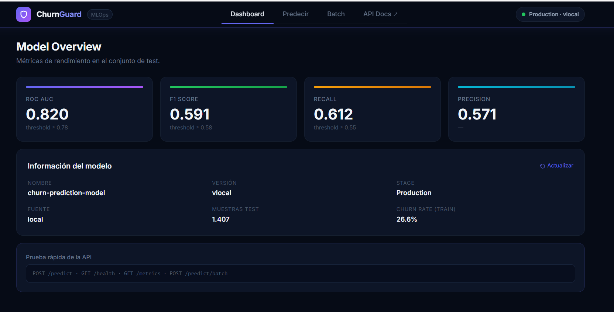
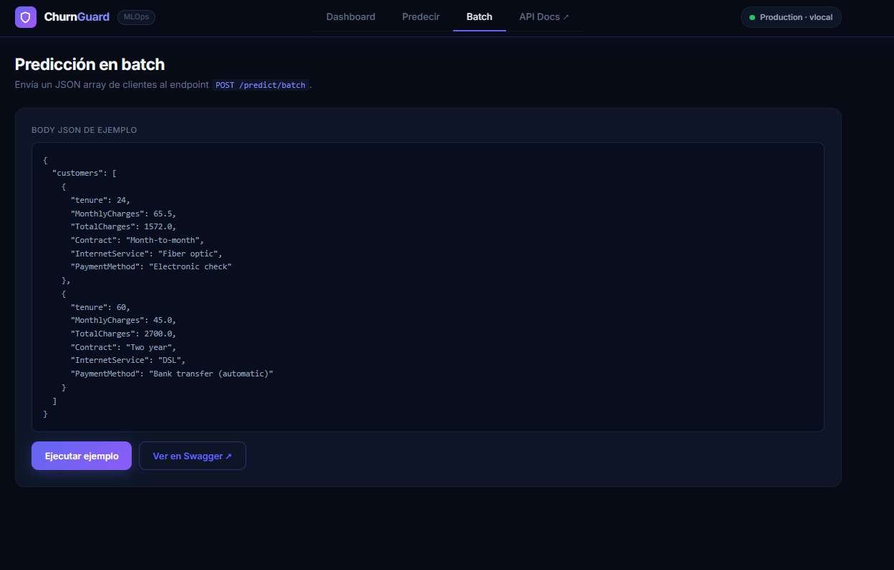
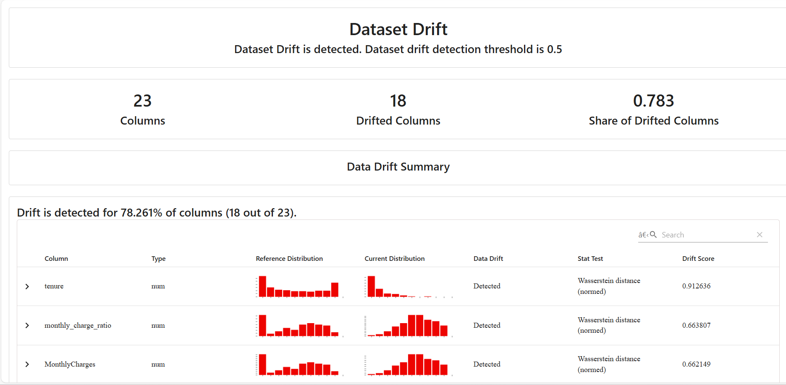

# ChurnGuard MLOps 🛡️

> **Plataforma end-to-end de predicción de churn** — Pipeline MLOps completo en producción con FastAPI, MLflow, DVC, Docker y GitHub Actions.

[](https://github.com/JavicR22/churnguard-mlops/actions/workflows/ci.yml)
[](https://www.python.org/)
[](https://fastapi.tiangolo.com/)
[](https://mlflow.org/)
[](https://www.docker.com/)
[](https://railway.app/)

---

## 🌐 Demo en Vivo

| Servicio | URL |
|----------|-----|
| **API + Dashboard** | https://churnguard-mlops-production.up.railway.app |
| **Swagger UI** | https://churnguard-mlops-production.up.railway.app/docs |
| **MLflow UI** | https://pacific-elegance-production.up.railway.app |

---

## ¿Qué hace este proyecto?

Predice si un cliente de telecomunicaciones va a cancelar su contrato (churn) usando un pipeline MLOps completo de producción. Entrenado sobre el dataset [Telco Customer Churn](https://www.kaggle.com/datasets/blastchar/telco-customer-churn) con ~7,000 clientes.

```
RAW DATA → DVC Pipeline → Feature Engineering → Training (3 modelos)
                                                        ↓
                                              MLflow Model Registry
                                                        ↓
Evidently Monitoring ← FastAPI + Dashboard ← Production Model
         ↑                      ↑
   Drift Detection         CI/CD GitHub Actions
```

---

## 📸 Screenshots

### Dashboard Principal — Métricas del Modelo


### Predicción en Tiempo Real con Gauge Visual


### Predicción en Batch


### Reporte de Data Drift — Evidently AI


---

## 🏗️ Arquitectura

```
┌─────────────────────────────────────────────────────────┐
│                    GitHub Actions CI/CD                  │
│  flake8 + black → pytest (61 tests) → Docker Build      │
└─────────────────────────────────────────────────────────┘
                          │
                          ▼
┌─────────────────────────────────────────────────────────┐
│                   Railway (Production)                   │
│                                                         │
│  ┌──────────┐    ┌──────────┐    ┌──────────────────┐  │
│  │PostgreSQL│◄───│  MLflow  │    │   FastAPI (API)  │  │
│  │  :5432   │    │  :8080   │    │      :8000       │  │
│  └──────────┘    └──────────┘    └──────────────────┘  │
│                                          │               │
│                              ┌───────────┴───────────┐  │
│                              │   Endpoints           │  │
│                              │  GET  /               │  │
│                              │  POST /predict        │  │
│                              │  POST /predict/batch  │  │
│                              │  GET  /metrics        │  │
│                              │  GET  /health         │  │
│                              │  POST /monitoring/run │  │
│                              └───────────────────────┘  │
└─────────────────────────────────────────────────────────┘
```

---

## 🔬 Resultados del Modelo

| Métrica | Valor | Threshold |
|---------|-------|-----------|
| **ROC AUC** | 0.820 | ≥ 0.78 ✅ |
| **F1 Score** | 0.591 | ≥ 0.58 ✅ |
| **Recall** | 0.612 | ≥ 0.55 ✅ |
| **Precision** | 0.571 | — |

**Modelos evaluados:** Logistic Regression · Random Forest · XGBoost  
**Mejor modelo:** XGBoost con SMOTE para balanceo de clases  
**Dataset:** 7,043 clientes · 26.5% churn rate

---

## 📊 Monitoreo de Drift

El sistema detecta automáticamente cuando los datos de producción se alejan del dataset de entrenamiento usando **Evidently AI**.

Ejecutando el endpoint `/monitoring/run-synthetic` con datos sintéticos sesgados:

```json
{
  "status": "drift_detected",
  "dataset_drift": true,
  "drifted_features": 18,
  "total_features": 23,
  "drift_share": 0.7826
}
```

**Features con mayor drift detectado:**
- `tenure` — Wasserstein distance: **0.91** (clientes más nuevos)
- `monthly_charge_ratio` — Wasserstein distance: **0.66** (cargos más altos)
- `InternetService` — Jensen-Shannon: **0.19** (más Fiber optic)
- `Contract` — Jensen-Shannon: **0.18** (más Month-to-month)

---

## 🚀 Stack Tecnológico

| Capa | Tecnología | Versión |
|------|-----------|---------|
| **API Serving** | FastAPI + Uvicorn | 0.111 |
| **Experimentos** | MLflow Tracking + Registry | 2.13 |
| **Versionado datos** | DVC | 3.51 |
| **Modelos** | Scikit-learn · XGBoost | 1.5 · 2.0 |
| **Monitoreo** | Evidently AI | 0.4.30 |
| **Infraestructura** | Docker + Docker Compose | — |
| **CI/CD** | GitHub Actions | — |
| **Base de datos** | PostgreSQL | 15 |
| **Despliegue** | Railway | — |

---

## ⚡ Inicio Rápido (Local)

### 1. Clonar y configurar entorno

```bash
git clone https://github.com/JavicR22/churnguard-mlops.git
cd churnguard-mlops

python -m venv venv
source venv/bin/activate  # Windows: venv\Scripts\activate
pip install -r requirements.txt
```

### 2. Descargar el dataset

Descarga el dataset de [Kaggle Telco Customer Churn](https://www.kaggle.com/datasets/blastchar/telco-customer-churn) y colócalo en:

```
data/raw/WA_Fn-UseC_-Telco-Customer-Churn.csv
```

### 3. Correr el pipeline completo

```bash
# Con DVC (recomendado)
dvc repro

# O manualmente
python src/data_prep.py
python src/train.py
python src/evaluate.py
```

### 4. Levantar todos los servicios con Docker

```bash
docker-compose up --build -d
```

Servicios disponibles:

| Servicio | URL |
|----------|-----|
| API + Dashboard | http://localhost:8000 |
| Swagger UI | http://localhost:8000/docs |
| MLflow UI | http://localhost:5000 |

### 5. Correr los tests

```bash
pytest tests/ -v --cov=src --cov=api
```

---

## 📡 Uso de la API

### Predicción individual

```bash
curl -X POST https://churnguard-mlops-production.up.railway.app/predict \
  -H "Content-Type: application/json" \
  -H "X-API-Key: dev-key-change-in-production" \
  -d '{
    "tenure": 24,
    "MonthlyCharges": 65.5,
    "TotalCharges": 1572.0,
    "Contract": "Month-to-month",
    "InternetService": "Fiber optic",
    "PaymentMethod": "Electronic check"
  }'
```

**Respuesta:**
```json
{
  "prediction_id": "36a15bf8-46a9-451e-...",
  "churn_probability": 0.527,
  "churn_prediction": true,
  "risk_level": "MEDIUM",
  "model_version": "vlocal",
  "model_stage": "Production",
  "timestamp": "2026-02-25T04:43:00"
}
```

### Predicción en batch

```bash
curl -X POST https://churnguard-mlops-production.up.railway.app/predict/batch \
  -H "Content-Type: application/json" \
  -d '{
    "customers": [
      {"tenure": 24, "MonthlyCharges": 65.5, "TotalCharges": 1572.0,
       "Contract": "Month-to-month", "InternetService": "Fiber optic",
       "PaymentMethod": "Electronic check"},
      {"tenure": 60, "MonthlyCharges": 45.0, "TotalCharges": 2700.0,
       "Contract": "Two year", "InternetService": "DSL",
       "PaymentMethod": "Bank transfer (automatic)"}
    ]
  }'
```

### Detectar drift en producción

```bash
curl -X POST https://churnguard-mlops-production.up.railway.app/monitoring/run \
  -H "X-API-Key: dev-key-change-in-production"
```

---

## 🗂️ Estructura del Proyecto

```
churnguard-mlops/
├── .github/
│   └── workflows/
│       ├── ci.yml            # Tests + lint en cada push
│       └── cd.yml            # Docker build en merge a main
├── api/
│   ├── main.py               # FastAPI app con dashboard integrado
│   ├── schemas.py            # Modelos Pydantic v2
│   └── templates/
│       └── dashboard.html    # Dashboard interactivo (Tailwind CSS)
├── data/
│   ├── raw/                  # Dataset original
│   └── processed/            # Parquets + feature_names.json
├── models/
│   └── preprocessor.joblib   # Pipeline sklearn serializado
├── monitoring/
│   ├── drift_detector.py     # Evidently AI integration
│   └── reports/              # Reportes HTML de drift
├── reports/
│   ├── metrics.json          # Métricas del modelo en test
│   └── confusion_matrix.png  # Matriz de confusión
├── scripts/
│   └── entrypoint.sh         # Docker entrypoint con health checks
├── src/
│   ├── data_prep.py          # Stage 1: limpieza + feature engineering
│   ├── train.py              # Stage 2: training + MLflow tracking
│   └── evaluate.py           # Stage 3: evaluación + threshold validation
├── tests/
│   ├── test_api.py           # Tests de endpoints FastAPI
│   ├── test_data.py          # Tests del pipeline de datos
│   └── test_model.py         # Tests de calidad del modelo
├── .coveragerc               # Configuración de cobertura
├── .dvc/                     # Configuración DVC
├── docker-compose.yml        # Stack completo: postgres + mlflow + api
├── Dockerfile                # Multi-stage build
├── Dockerfile.mlflow         # Imagen MLflow personalizada
├── dvc.yaml                  # Pipeline DVC (3 stages)
├── Makefile                  # Comandos de desarrollo
├── params.yaml               # Hiperparámetros versionados
└── requirements.txt
```

---

## 🔧 Comandos Make

```bash
make format       # Formatea con black
make lint         # Verifica flake8 + black
make test         # Corre todos los tests
make pipeline     # Ejecuta dvc repro
make up           # Levanta el stack Docker
make down         # Baja los servicios
make logs         # Ver logs en tiempo real
make health       # Verifica estado de la API
make drift        # Ejecuta análisis de drift
```

---

## 🔄 Pipeline CI/CD

Cada push a cualquier rama dispara el pipeline de CI:

```
Push → Lint (flake8 + black) → Tests (61 tests, 75%+ coverage) → Docker Build Validate
                                                                          │
Merge a main ──────────────────────────────────────────────────────────► CD
                                                                    Docker Hub push
                                                                    Railway deploy
```

---

## 👤 Autor

**Javier** — Proyecto de portafolio MLOps

[](https://github.com/JavicR22/churnguard-mlops)
